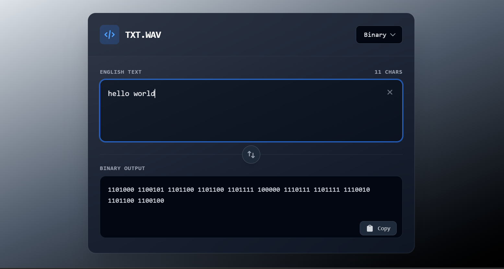

# TXT.WAV - Universal Text Converter

 <!-- Placeholder, replace with actual project logo if available -->

TXT.WAV is a modern, intuitive web application built with Next.js that provides real-time bidirectional conversion between standard English text and various digital formats, including Binary, Morse Code, ASCII, and Hexadecimal. Ideal for developers, enthusiasts, or anyone needing quick text transformations.

## ✨ Features

*   **Bidirectional Conversion:** Seamlessly convert text to code and code back to text.
*   **Multiple Formats:** Supports conversion for:
    *   **Binary:** English Text ↔ Binary
    *   **Morse Code:** English Text ↔ Morse Code
    *   **ASCII:** English Text ↔ ASCII Decimal Representation
    *   **Hexadecimal:** English Text ↔ Hexadecimal Representation
*   **Real-time Updates:** Input changes are instantly reflected in the output.
*   **Intuitive UI:** Clean and responsive user interface powered by Tailwind CSS.
*   **Copy to Clipboard:** Easily copy the converted output with a single click.
*   **Swap Direction:** Quickly switch the conversion direction, with automatic transfer of the previous output to the new input.
*   **Clear Input:** Convenient button to clear the input field.

## 🚀 Technologies Used

*   **Next.js** (v16.1.0) - React framework for production.
*   **React** (v19.2.3) - Frontend JavaScript library.
*   **TypeScript** (v5) - Statically typed superset of JavaScript.
*   **Tailwind CSS** (v4) - A utility-first CSS framework for rapid UI development.
*   **Heroicons** (v2.2.0) - A set of free MIT-licensed high-quality SVG icons.
*   **Geist Fonts** - Optimized and loaded via `next/font` for a modern typography.

## 📦 Installation

To get a local copy up and running, follow these simple steps.

### Prerequisites

*   Node.js (LTS version recommended)
*   npm or yarn or pnpm or bun

### Steps

1.  **Clone the repository:**
    ```bash
    git clone https://github.com/your-username/text-converter.git # Replace with actual repo URL
    cd text-converter
    ```

2.  **Install dependencies:**
    ```bash
    npm install
    # or
    yarn install
    # or
    pnpm install
    # or
    bun install
    ```

## 🏃 Running the Project

### Development Server

To run the project in development mode:

```bash
npm run dev
# or
yarn dev
# or
pnpm dev
# or
bun dev
```

Open [http://localhost:3000](http://localhost:3000) in your browser to see the application. The page will hot-reload as you make edits.

### Production Build

To build the application for production:

```bash
npm run build
# or
yarn build
# or
pnpm build
# or
bun build
```

To start the production server:

```bash
npm run start
# or
yarn start
# or
pnpm start
# or
bun start
```

## 👨‍💻 Usage

The TXT.WAV interface is designed for ease of use:

1.  **Select Conversion Format:** Use the dropdown menu in the top-right corner to choose between Binary, Morse, ASCII, or Hex.
2.  **Set Direction:** The default direction is "English→Code". Click the <kbd>ArrowsUpDownIcon</kbd> button in the middle to swap to "Code→English".
3.  **Enter Input:** Type or paste your text/code into the upper textarea. The conversion happens in real-time.
    *   Click the <kbd>XMarkIcon</kbd> button next to the input field to clear it.
4.  **View Output:** The converted result will appear in the lower textarea.
5.  **Copy Output:** Click the <kbd>ClipboardIcon</kbd> button below the output textarea to copy the result to your clipboard. A "Copied!" message will briefly appear.

## 📁 Project Structure

```
.
├── app/
│   ├── favicon.ico
│   ├── globals.css           # Global Tailwind CSS styles
│   ├── layout.tsx            # Root layout for Next.js app (fonts, global styles)
│   ├── page.tsx              # Main converter application page
│   └── utils/                # Utility functions for various conversions
│       ├── ascii.ts          # ASCII conversion logic
│       ├── binary.ts         # Binary conversion logic
│       ├── hex.ts            # Hexadecimal conversion logic
│       └── morse.ts          # Morse Code conversion logic
├── public/                   # Static assets (images, icons)
├── .next/                    # Build output (generated by Next.js)
├── node_modules/             # Project dependencies
├── eslint.config.mjs         # ESLint configuration
├── next-env.d.ts             # TypeScript declaration for Next.js environment
├── next.config.ts            # Next.js configuration
├── package.json              # Project metadata and dependencies
├── postcss.config.mjs        # PostCSS configuration (for Tailwind CSS)
├── README.md                 # Project README file
└── tsconfig.json             # TypeScript compiler configuration
```

## 🤝 Contributing

Contributions are what make the open-source community such an amazing place to learn, inspire, and create. Any contributions you make are **greatly appreciated**.

1.  Fork the Project
2.  Create your Feature Branch (`git checkout -b feature/AmazingFeature`)
3.  Commit your Changes (`git commit -m 'Add some AmazingFeature'`)
4.  Push to the Branch (`git push origin feature/AmazingFeature`)
5.  Open a Pull Request

## 📄 License

Distributed under the MIT License. See `LICENSE` for more information. <!-- Create a LICENSE file in the root directory if not present -->

## 🙏 Acknowledgements

*   [Next.js](https://nextjs.org/)
*   [React](https://react.dev/)
*   [Tailwind CSS](https://tailwindcss.com/)
*   [Heroicons](https://heroicons.com/)
*   [Geist Fonts](https://vercel.com/font)